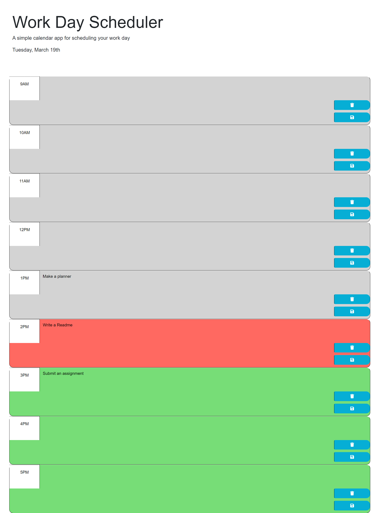

# Workday Scheduler 
A web application that takes input from the user in order to plan your work day
## Description
The goal of this project was to make an interactive scheduler that can take input from a user in the text area of a specific time block and allow the user to save the input in the corresponding time block. The goal was also to display the current date to the user in the header and to show the user past, present, and future time blocks using an intuitive color coded interface.Lastly, the user input can be removed using the clear button. Alerts/confirmations appear at the top of the browser window confirming that the input has been saved or cleared.

## Usage
The user is advised to click the text area of the time block they would like to add to. The user then types the desired task or item into the task area and clicks the "save" icon. When the save icon is clicked an alert will appear at the top of the window confirming that the input has been saved. At this point the user is advised to click the "ok" button on the alert. The user input for that time block is now saved in local storage and will display even when the page is refreshed. To clear the user input for that time block the user simply needs to click the "trash" icon. The input will be removed from that time block after "ok" is clicked on the alert confirming the input has been cleared. The user can find the date displayed at the top of the application on the left side of the header. The user can also refer to past, present, and future times in the schedule by viewing the color coding in the application. Grey time blocks indicate time that has already past, red is the current hour, and green are time blocks in the future.

## Credits 
Base code and tips for this project were provided by the Uconn coding boot camp program. Final code was written and completed by Luke Stroehlein.

## License
Please refer to LICENSE in the repo.